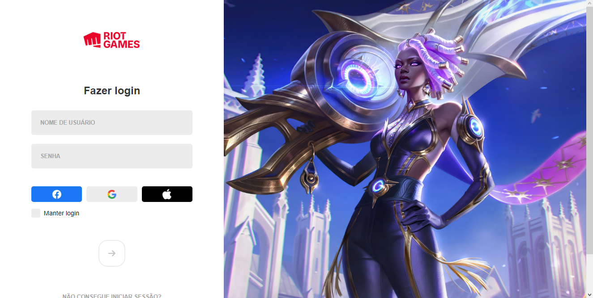

# login-lol

## 🎯 Objetivo

Projeto desenvolvido através do tutorial do [Manual do Dev](https://www.youtube.com/watch?v=tyVvNj-UvxM&t=1s) com o objetivo de criar um clone da tela de login do jogo League of Legends, e relembrar conceitos como seletores avançados css, pseudo-classes, pseudo-elementos, funções e eventos no JavaScript.

## 🛠️ Tecnologias utilizadas

Para o desenvolvimento deste site utilizei as seguintes tecnologias:

- HTML;
- CSS;
- JavaScript;

## ⚙️ Funcionalidades

- Validar senha: Quando digitado uma senha de no mínimo 8 caracteres o botão de entrar torna-se vermelho indicando que a senha foi validada.
